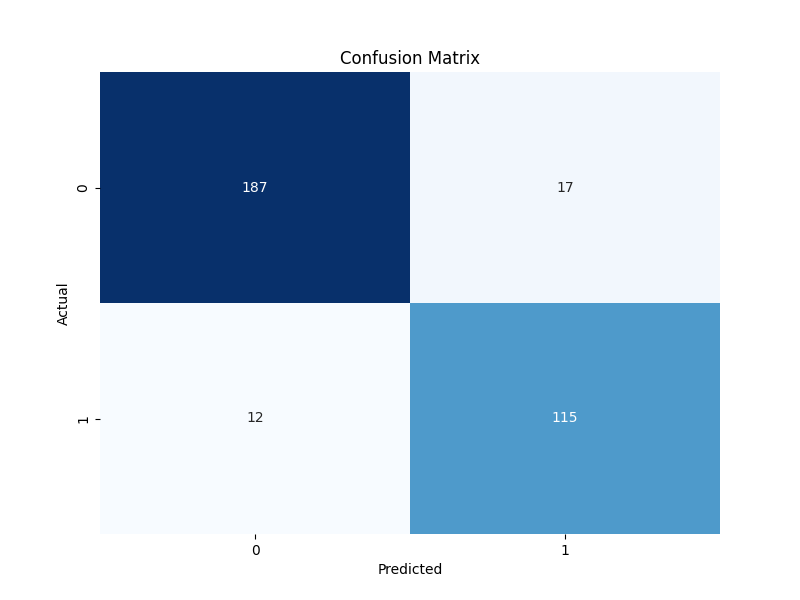

<h1>Titanic</h1>

<h2>Description</h2>
We want to perform some classification models starting from the most basic one, Logistic Regression. Our aim is to predict wheter a passenger in The Titanic survived or not.
<h2>Results</h2>
<h3>Logistic Regression</h3>
Test Accuracy: 91% 
Test Precission: 87%  
Classification Matrix:

<h2>Languages and Utilities Used</h2>

- <b>Python</b>

